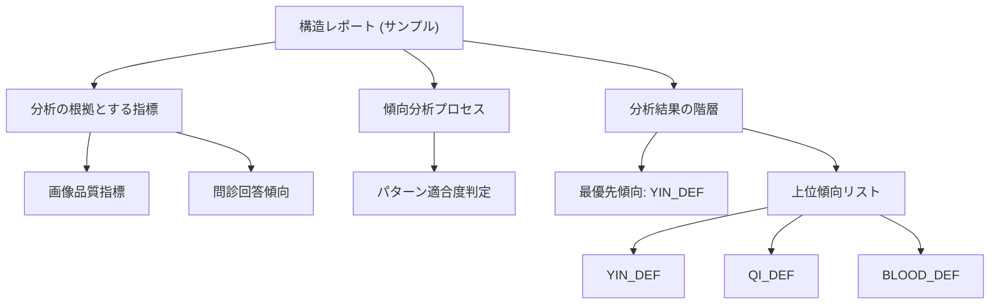

# 説明ツリー (Explain Tree v1)
> 内部確認用：本資料は医療的な「診断」ではなく、AIの内部推論プロセスを視覚化したものです。

## 構造図 (Mermaid)

## 階層リスト
# 構造レポート (サンプル)
  現在のセルフチェックにおける論理構造の要約です。
## 分析の根拠とする指標
- 画像品質指標
  適切な環境で撮影されています。
  > [撮影状況]
- 問診回答傾向
  一部の回答に基づき、傾向を補正。
  > [回答状況]
## 傾向分析プロセス
  中医学的な指標に基づき、入力情報を総合的に重み付けしています。
- パターン適合度判定
  現在の特徴と、既知の基本分類パターンの合致度を算出。
## 分析結果の階層
- 最優先傾向: YIN_DEF
  最も関連性が高いと推定される状態です。
  > [Primary]
- 上位傾向リスト
  関連性が認められる上位 3 項目。
- YIN_DEF
- QI_DEF
- BLOOD_DEF
